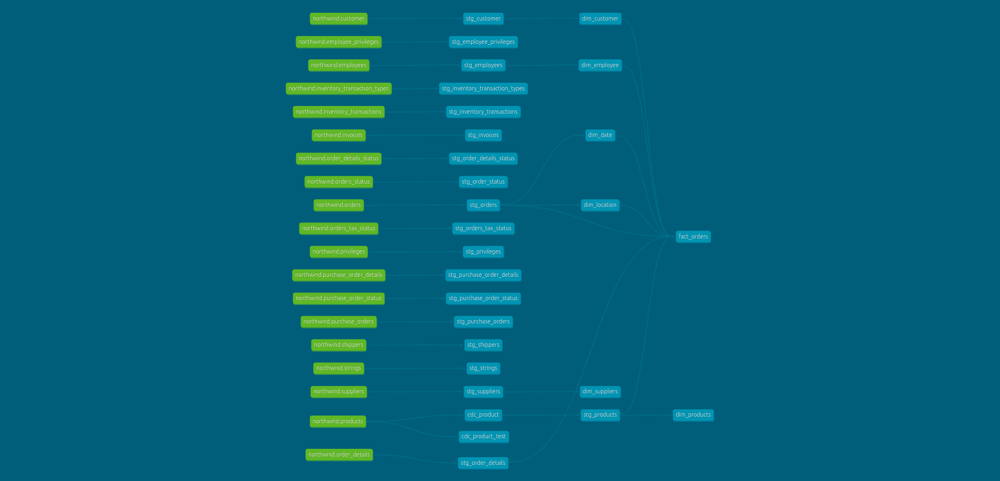

# Northwind Practice - dbt Learning Project



## 🎯 Project Overview

This is a comprehensive dbt practice project built on the classic **Northwind database**, designed to demonstrate modern data warehouse concepts and dbt best practices. The project implements a complete **ELT pipeline** transforming raw OLTP data into a dimensional data warehouse suitable for analytics.

## 📊 Business Context

The Northwind database represents a fictional trading company that imports and exports specialty foods worldwide. This project models the company's:
- **Sales Operations**: Customer orders, product sales, shipping
- **Inventory Management**: Product catalog, supplier relationships, stock movements  
- **Human Resources**: Employee information and organizational structure
- **Financial Tracking**: Order processing, invoicing, payment management

## 🏗️ Architecture Overview

### Data Warehouse Design Pattern: **Medallion Architecture**

```
┌─────────────────┐    ┌─────────────────┐    ┌─────────────────┐
│                 │    │                 │    │                 │
│   Raw Sources   │ -> │   Staging (🥉)  │ -> │   Marts (🥈)    │
│   (dl_northwind)│    │   (stg schema)  │    │   (dwh schema)  │
│                 │    │                 │    │                 │
└─────────────────┘    └─────────────────┘    └─────────────────┘
                                                       │
                                                       v
                                               ┌─────────────────┐
                                               │                 │
                                               │  Platinum (🥇)  │
                                               │  (plat schema)  │
                                               │                 │
                                               └─────────────────┘
```

## 📁 Project Structure

```
northwind_practice/
├── 📋 dbt_project.yml              # Project configuration
├── 📊 models/
│   ├── 📄 source.yml               # Source table definitions (24 tables)
│   ├── 🔄 staging/                 # Bronze Layer - Data cleaning & standardization
│   │   ├── stg_customers.sql       # Customer dimension staging
│   │   ├── stg_employees.sql       # Employee dimension staging  
│   │   ├── stg_products.sql        # Product dimension staging
│   │   ├── stg_suppliers.sql       # Supplier dimension staging
│   │   ├── stg_orders.sql          # Orders fact staging
│   │   ├── stg_order_details.sql   # Order line items staging
│   │   ├── stg_inventory_transactions.sql # Inventory movements
│   │   └── ... (19 staging models total)
│   ├── 🏪 marts/                   # Silver Layer - Business logic & dimensional modeling
│   │   ├── dimensions/             # Dimension tables (6 models)
│   │   │   ├── dim_customer.sql    # Customer dimension with SCD Type 1
│   │   │   ├── dim_employee.sql    # Employee dimension
│   │   │   ├── dim_products.sql    # Product dimension with SCD Type 2
│   │   │   ├── dim_suppliers.sql   # Supplier dimension
│   │   │   ├── dim_date.sql        # Date dimension (auto-generated)
│   │   │   └── dim_location.sql    # Location dimension
│   │   └── facts/                  # Fact tables
│   │       └── fact_orders.sql     # Sales transactions fact table
│   └── 💎 platinum/                # Gold Layer - Business metrics & KPIs (empty)
├── 📸 snapshots/                   # SCD Type 2 implementations
│   ├── CDC_product.sql             # Product change data capture
│   └── CDC_product_test.sql        # Test snapshot for learning
├── 🗄️ database_script/             # Source database setup
│   ├── northwind_oltp_create-tables-script.sql
│   └── nortwind_oltp_insert-data-script.sql
├── 🔧 macros/                      # Custom macros (empty - future expansion)
├── 🌱 seeds/                       # Reference data (empty - future expansion)
├── 🧪 tests/                       # Data quality tests (empty - future expansion)
└── 📈 docs/                        # Generated documentation
    └── dbt-dag.png                 # Lineage diagram
```

## 🗃️ Data Model Details

### Source System
- **Schema**: `dl_northwind`  
- **Tables**: 24 normalized OLTP tables
- **Key Entities**: customers, employees, products, suppliers, orders, order_details, inventory_transactions

### Staging Layer (`stg` schema)
**Purpose**: Data cleaning, standardization, and type casting
- **Materialization**: Tables for performance
- **Pattern**: One staging model per source table
- **Key Features**:
  - Adds `ingestion_timestamp` for audit trail
  - Standardizes column naming conventions
  - Basic data type conversions
  - Minimal business logic

### Marts Layer (`dwh` schema)
**Purpose**: Business-focused dimensional modeling

#### 📏 Dimensions (6 tables)
1. **`dim_customer`** - Customer master data (SCD Type 1, incremental with merge)
2. **`dim_employee`** - Employee information with location linkage
3. **`dim_products`** - Product catalog with SCD Type 2 via snapshots
4. **`dim_suppliers`** - Supplier master data with incremental updates
5. **`dim_date`** - Auto-generated calendar dimension from order date range
6. **`dim_location`** - Hash-based geographical reference

#### 📊 Facts (1 table)
1. **`fact_orders`** - Sales transaction details
   - **Grain**: One row per order line item
   - **Measures**: quantity, unit_price, discount, shipping_fee, taxes
   - **Dimensions**: customer, employee, product, dates (order/ship), location, shipper
   - **Features**: Incremental materialization, unique transaction ID

### Snapshots Layer
1. **`cdc_product`** - Product change data capture (SCD Type 2)
   - Tracks: name, supplier, category, pricing, discontinued status
   - Strategy: `check` for column comparison
   - Provides `dbt_valid_from/to` for temporal queries

## ⚙️ Technical Implementation

### Materialization Strategy
```yaml
models:
  northwind_practice:
    staging:
      +materialized: table      # Fast reads for downstream models
      +schema: stg
    marts:   
      +materialized: table      # Performance for analytics
      +schema: dwh
    platinum:
      +materialized: view       # Real-time business metrics
      +schema: plat
```

## 🚀 Getting Started

### Prerequisites
- dbt Core 1.10+
- PostgreSQL database
- Python environment with dbt-postgres adapter

### Setup Instructions

1. **Configure Profile** (`~/.dbt/profiles.yml`):
   ```yaml
   northwind_practice:
     target: dev
     outputs:
       dev:
         type: postgres
         host: localhost
         user: your_username
         password: your_password
         port: 5432
         dbname: your_database
         schema: public
   ```

2. **Setup Source Data**:
   ```bash
   psql -f database_script/northwind_oltp_create-tables-script.sql
   psql -f database_script/nortwind_oltp_insert-data-script.sql
   ```

3. **Run dbt**:
   ```bash
   dbt deps && dbt run && dbt snapshot
   dbt docs generate && dbt docs serve
   ```

## 📈 Key Learning Outcomes

### **dbt Core Concepts**
- ✅ **Modular SQL Development**: 30+ connected models
- ✅ **Incremental Models**: Efficient large table processing
- ✅ **Snapshots**: SCD Type 2 change tracking
- ✅ **Ref() and Source() Functions**: Model dependencies and lineage
- ✅ **Multiple Materializations**: Tables, views, incremental strategies

### **Data Warehouse Design**
- ✅ **Dimensional Modeling**: Star schema with facts and dimensions
- ✅ **SCD Patterns**: Both Type 1 and Type 2 implementations
- ✅ **Data Lineage**: Clear bronze → silver → gold progression
- ✅ **Surrogate Keys**: Hash-based key generation
- ✅ **Date Dimensions**: Automated calendar table creation

### **Advanced dbt Features Demonstrated**

#### 1. **Incremental Models**
```sql
{{
    config (
        MATERIALIZED = 'incremental',
        strategy = 'merge',
        unique_key = 'transaction_id'
    )
}}
```

#### 2. **Snapshots (SCD Type 2)**
```sql

{{
    config(
        target_schema='snapshot',
        unique_key='product_id',
        strategy='check',
        check_cols=['product_name', 'supplier_id', 'unit_price']
    )
}}
```

#### 3. **Dynamic Date Dimension**
```sql
with date_range as(
    select 
        min("order_date") as min_order,
        max("order_date") as max_order
    from {{ ref('stg_orders') }}
)
```

## 📊 Model Summary

### Staging Models (19 models)
All staging models follow the pattern: `select *, current_timestamp as ingestion_timestamp from {{ source() }}`

### Dimension Models (6 models)
| Model | Grain | SCD Type | Features |
|-------|-------|----------|----------|
| `dim_customer` | One per customer | Type 1 | Incremental, location SK |
| `dim_employee` | One per employee | Type 1 | Contact info, location SK |
| `dim_products` | One per product version | Type 2 | Price history via snapshots |
| `dim_suppliers` | One per supplier | Type 1 | Contact details, location SK |
| `dim_date` | One per date | - | Auto-generated, hierarchies |
| `dim_location` | One per address | - | Hash-based SK |

### Fact Models (1 model)
| Model | Grain | Measures | Update Pattern |
|-------|-------|----------|----------------|
| `fact_orders` | Order line item | quantity, unit_price, discount, fees, taxes | Incremental |

## 🔮 Future Enhancements

- [ ] **Data Quality Tests**: Comprehensive test suite
- [ ] **Custom Macros**: Reusable transformation functions  
- [ ] **Seed Data**: Reference tables for lookups
- [ ] **Platinum Layer**: Business KPIs and metrics
- [ ] **Exposures**: BI tool integrations
- [ ] **dbt Packages**: External package utilization

## 📚 Resources

- **dbt Documentation**: [docs.getdbt.com](https://docs.getdbt.com)
- **Dimensional Modeling**: Kimball methodology
- **Northwind Database**: Classic Microsoft sample database

---

*This project demonstrates practical implementation of dimensional modeling, change data capture, and incremental processing patterns using dbt.*
